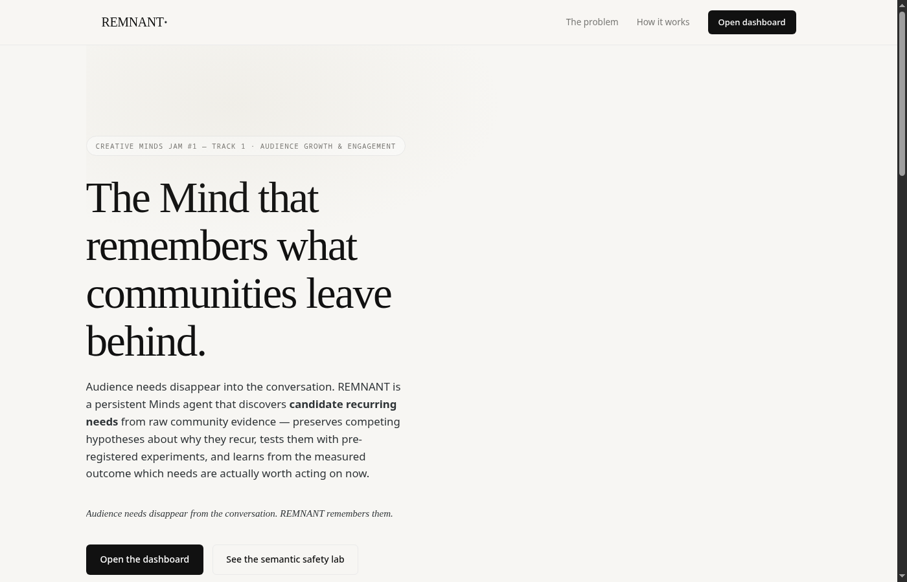

<p align="center">
  <a href="https://remnant-two.vercel.app"></a>
</p>

<p align="center">
    <em>The Mind that remembers what communities leave behind.</em>
</p>

<p align="center">
<a href="https://remnant-two.vercel.app" target="_blank">
    
</a>
<a href="https://github.com/subheeksh5599/remnant/actions" target="_blank">
    
</a>
<a href="https://www.animocabrands.com/minds" target="_blank">
    
</a>
<a href="https://opensource.org/licenses/MIT" target="_blank">
    
</a>
</p>

---

**Website**: <a href="https://remnant-two.vercel.app/" target="_blank">remnant-two.vercel.app</a>

**Documentation**: <a href="https://github.com/subheeksh5599/remnant/tree/main/docs" target="_blank">docs</a>

**REMNANT Minds**: <a href="https://www.animocabrands.com/minds" target="_blank">Minds by Animoca Brands</a>

---

REMNANT is a persistent Minds agent that discovers candidate recurring needs across a creator's community, preserves competing explanations about why they recur, and learns from pre-registered experiments what is actually worth acting on now.

**[Features](#features)** - **[Requirements](#requirements)** - **[Installation](#installation)** - **[Usage](#usage)** - **[Data sources](#data-sources)** - **[Contributors](#contributors)**

## Features

- Easy to use, lightweight framework to develop persistent community-memory intelligence fast.
- **Cross-language need discovery**: a transparent concept glossary + token overlap links "beginner ZK tutorial" (2022) to "start building with zero knowledge" (2026) as a *candidate* — never a merge. Deterministic, auditable, no LLM inside the math.
- **Competing hypotheses (H1–H4)**: persistent need · new cohort · temporary trend · semantic coincidence. Evidence strength is qualitative (low/medium/high); contradicting evidence is surfaced, never suppressed.
- **Pre-registered experiments**: metric, threshold, population and window locked *before* observing. The verdict is pure arithmetic — `observed 0.067 >= threshold 0.040 → CLEARED`. Creator-defined overrides supported and recorded.
- **Persistent Minds memory with recovery**: every belief-critical change is mirrored into the Minds agent's conversation, and `/api/v1/minds/recover/{rid}` reads it back — a fresh session can recover what the agent knew even when the local store is empty.
- **Autonomous observatory**: on durable deployments, a background thread revisits dormant remnants on an interval (cooldown + action provenance + approval boundaries) with zero page loads.
- Support for storing, managing and retrieving provenance-first evidence (source, author, url, timestamps).

## Requirements

**REMNANT backend requires Python version 3.12 or higher.** **The frontend requires Node 18 or higher.**

> It is recommended to use a [virtual environment](https://docs.python.org/3/library/venv.html) for installing remnant core, in order to avoid dependency conflicts. You can use your favorite virtual environment management system, like [conda](https://docs.conda.io/en/latest/), [poetry](https://python-poetry.org/), or [uv](https://docs.astral.sh/uv/) for example.

Furthermore, the following software packages need to be installed (or already present) in your system:

- **Ubuntu**: `sudo apt-get install python3.12 python3.12-venv curl git nodejs npm`
- **Mac OS**: `brew install python node curl git`
- **Windows**

    > We recommend using [Windows Subsystem for Linux](https://learn.microsoft.com/en-us/windows/wsl/install) and then following the Linux instructions.

An optional `MINDS_BUILDER_API_KEY` + `MIND_ID` (from [Minds by Animoca Brands](https://www.animocabrands.com/minds)) enables live memory mirroring and recovery. Without them the deterministic core runs fully; `/api/v1/mind` reports `available=false` honestly.

## Installation

You can install REMNANT directly from the repository:

```bash
git clone https://github.com/subheeksh5599/remnant.git && cd remnant/backend
uv venv .venv
uv pip install -e .
source .venv/bin/activate
```

Then you can run remnant in your python shell, notebook or application as follows:

```python
from remnant.app import app
```

... and just like that, you're ready to go! Now, there are multiple ways to configure REMNANT, refer to the [relevant documentation pages](https://github.com/subheeksh5599/remnant/tree/main/docs) for more information.

## Usage

For example, [ingest the labeled demo corpus](https://github.com/subheeksh5599/remnant/tree/main/docs) and let REMNANT discover the needs itself:

```python
from fastapi.testclient import TestClient
from remnant.app import app

with TestClient(app) as c:
    demo = c.post("/api/v1/demo/load").json()          # ids all SYNTHETIC
    print(demo["loaded"], "remnants discovered")

    # 1. register a need hypothesis
    r = c.post("/api/v1/remnants", json={
        "title": "Beginner ZK education",
        "underlying_need_hypothesis": "Beginners want an accessible on-ramp to zero-knowledge education.",
    }).json()
    rid = r["remnant_id"]

    # 2. ingest raw community evidence (provenance-first)
    c.post(f"/api/v1/remnants/{rid}/expressions", json={
        "text": "Can you make a beginner ZK tutorial?",
        "source_kind": "youtube_comment", "source_id": "yt-2022-01",
        "occurred_at": "2022-06-01T00:00:00Z",
    })

    # 3. plan a pre-registered experiment (or override its fields)
    exp = c.post(f"/api/v1/remnants/{rid}/experiments").json()

    # 4. record the observation — deterministic verdict
    out = c.post(f"/api/v1/remnants/{rid}/experiments/{exp['experiment_id']}/outcome",
                 json={"observed_value": 0.067}).json()
    # -> observed 0.067 >= pre-registered 0.040 -> CLEARED; state -> revisited

    # 5. ask the Mind what it believes, then run the semantic-safety test
    belief = c.get(f"/api/v1/remnants/{rid}/belief").json()["belief"]
    guard = c.post("/api/v1/adversarial/analyze", json={
        "expression_a": "How do I learn ZK?",
        "expression_b": "ZK badge for my profile looks broken",
    }).json()  # -> different_need, high confidence (collision guard)
```

Please refer to the [documentation](https://github.com/subheeksh5599/remnant/tree/main/docs) to learn more about how to use REMNANT.

## Data sources

REMNANT thrives on real community evidence with full provenance (source kind, id, url, author, timestamps), and the list of ingestion paths is growing:

- YouTube comments (`scripts/import_youtube.py` — real public comments, no API key)
- Discord / Telegram exports
- GitHub discussions and issues
- Twitter mentions
- Email digests
- Any creator-provided export (CSV/JSON/paste)

If you want to connect your community's data to REMNANT, consult the [ingestion documentation](https://github.com/subheeksh5599/remnant/tree/main/docs), you'll be surprised how simple it is.

## Contributors

<table>
  <tbody>
    <tr>
      <td align="center" valign="top" width="14.28%"><a href="https://github.com/subheeksh5599"><br /><sub><b>Komari Subheeksh</b></sub></a></td>
    </tr>
  </tbody>
</table>

Want to be part of the persistent community-memory revolution? All contributions are welcome! Check out our [contribution guide](https://github.com/subheeksh5599/remnant/tree/main/docs) to learn more about how to develop with and for REMNANT.